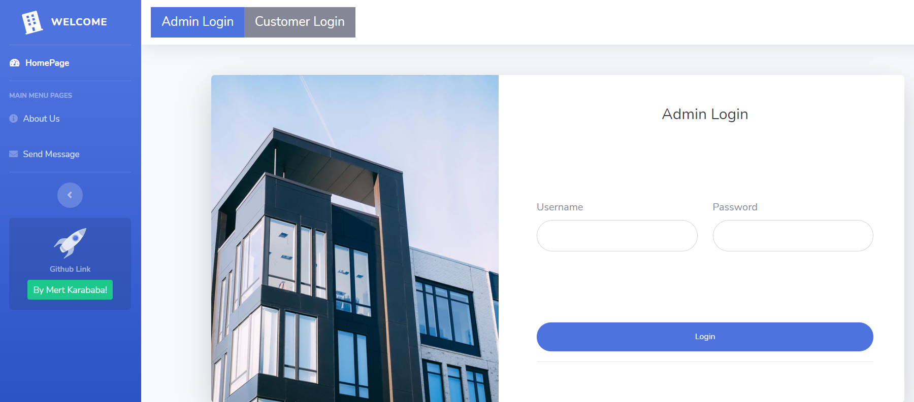

# This is an Apartment Management system by Mert Karababa
### Login informations
Admin user name : mert  
admin password: mert     
Customer user name : mert2    
customer password : mert2   
Databse name : apartment   
After logged in with admin name you can create a new admin or new customers and login with the informations you wrote.

## Abilities

### Admin Side

Register another admin with admin permission.

Login with any admin registered in to system.

Register New Costumers. 

Update Delete and Search costumers.

Check payments from Tenants.php page with table and  Delete payments also available.

Update Fee

Open Expenses with price and description

Create new Apartment Block with new Flat

Delete and update Flats like change their price etc.

Update Rents with given rate value.

Extended Search page with customer name and flat door number.

Create A New Announcement or Event that customer can see if it assign on their apartment.

Admin dashboard added for easy reach (css taken from https://fonts.googleapis.com/).

Admin can see who paid expense-rent-fee and who did not.

Flat history added to all flats , admin can see who moved out when in specific flat

Admin Can open Due for all Customers

--------------------------------------------------------------------------------
### Costumer Side
Login with costumer name and password which registered from admin side. 

Check Our costumer informations, our name, our surname, our door number , etc.

Pay our current rent that information taken from our door number.

See Expenses and can pay expenses.

See Monthly Fees and can pay Fees. 

See expense details with how much money spent on what and what balance is.

-------------------------------------------------------------------------------
#### Updates

Update 1   (25.12.2020)
- To better visual and easy reach , splitted folders as Admin and Costumer.
--------------------------------------------------------------------------------

Update 2 (26.12.2020)
- Delete and Update Customers via Php in html from database.
--------------------------------------------------------------------------------
Update 3 (27.12.2020)
- Created admin/admin2.css and implement on Landlord.php for better table
--------------------------------------------------------------------------------
Update 4 (28.12.2020)
- Added Payment function for costumer, also added tenants.php on admin side to see payment tables.

--------------------------------------------------------------------------------
Update 5 (29.12.2020)
- Changing the fees of the selected Apartment
- Create expenses with price and description
- Added Flat Function for adding new flats and creating new apartments 

--------------------------------------------------------------------------------

Update 6 (30.12.2020)
- Costumer can see Change her/his registered phone number and email.
- Change Rents with given rate (1 to 100  for ex 1=%1, 100=%100).
- Costumer can see expenses and fees and can pay them.
- Added Some extra Css lines To Costumer side for view expenses and fees in tables.

--------------------------------------------------------------------------------

Update 7 (02.01.2021)
- Added Some extra Css for admin dashboard
- Admin can write how much money spent on specific expense detail.
- Costumer can see expense details and how much money spent on what.
- Admin can create announcement/event for selected apartment.

--------------------------------------------------------------------------------
Update 8 (04.01.2021)
- Admin can add spent details to show customers how much expense spent on what.
- Added Some extra Css for Customer dashboard
- Admin can see who paid expense,fee,rent and who did not.
- Admin can see flat history
- Costumer can see who paid expenses and expense spent on what
- Customer passwords are hashed.

--------------------------------------------------------------------------------
Update 9 (25.01.2021)
- Admin can add dues with details
- Admin can spend money that collected from dues with details
- Admin can see who paid from Pie Chart

--------------------------------------------------------------------------------
# Images From This Website
--------------------------------------------------------------------------------
## HomePage

--------------------------------------------------------------------------------

## Admin Side

----------------------------------------------------------------------------------------------------------------------------------------------------------------

----------------------------------------------------------------------------------------------------------------------------------------------------------------

----------------------------------------------------------------------------------------------------------------------------------------------------------------

## Customer Side

----------------------------------------------------------------------------------------------------------------------------------------------------------------

----------------------------------------------------------------------------------------------------------------------------------------------------------------

----------------------------------------------------------------------------------------------------------------------------------------------------------------

----------------------------------------------------------------------------------------------------------------------------------------------------------------

